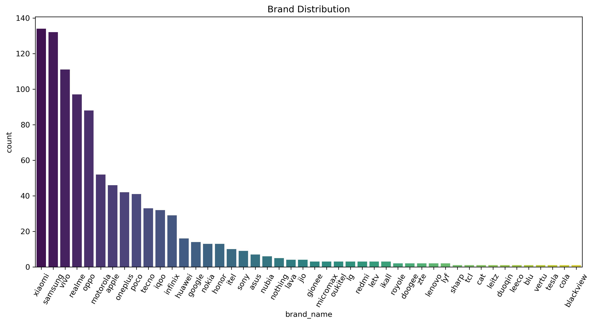
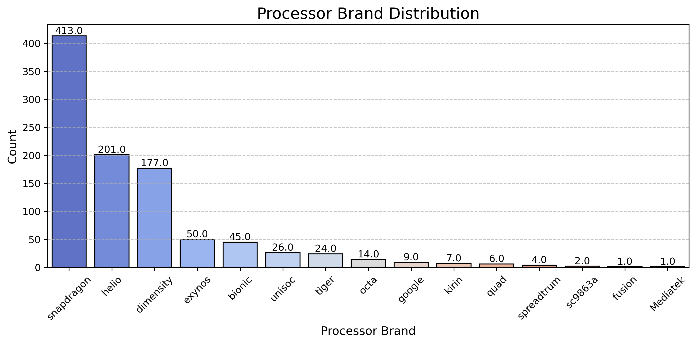
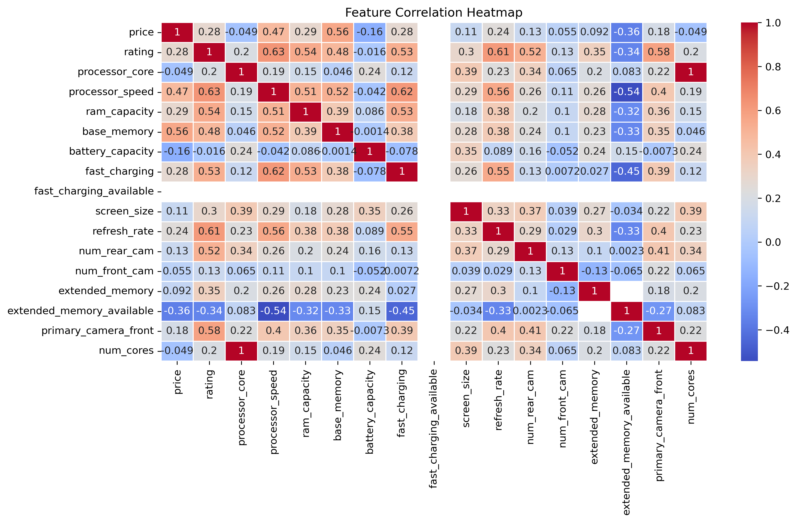

# 📱 Mobile Phone Data Analysis Dashboard  
**An Exploratory Data Analysis (EDA) Project**  

---

## 📊 Project Overview  
A comprehensive analysis of mobile phone specifications and pricing trends. This project cleans, processes, and visualizes smartphone data to uncover insights into feature-price relationships, brand performance, and technical specifications. Key highlights:  
- **Data Wrangling**: Cleaning messy data (missing values, inconsistent naming, column splits).  
- **Visual Analytics**: Interactive plots for univariate, bivariate, and multivariate analysis.  
- **Price Prediction**: Correlation analysis and KNN-based price estimation.  

**Dataset**: Contains specs like brand, RAM, battery capacity, processor, camera, and price for 1,000+ smartphones.  

---

## 🎥 Project Demo  
[Watch Demo Video](reports/Docs%202025-04-07%2020-49-47%20(1)%20(1).mp4)


---

## 📸 Key Visualizations  

### **Brand Distribution**  
 

### **Processor Brand Dominance**  
  

### **Feature Correlation Matrix**  
  

### Interactive Visualizations

- [Figure 349](https://Niair.github.io/Mobile-Device-Data-Insights-Using-EDA/figure_349.html)
- [Figure 351](https://Niair.github.io/Mobile-Device-Data-Insights-Using-EDA/figure_351.html)
- [Figure 353](https://Niair.github.io/Mobile-Device-Data-Insights-Using-EDA/figure_353.html)
- [Figure 355](https://Niair.github.io/Mobile-Device-Data-Insights-Using-EDA/figure_355.html)
- [Figure 357](https://Niair.github.io/Mobile-Device-Data-Insights-Using-EDA/figure_357.html)
- [Figure 359](https://Niair.github.io/Mobile-Device-Data-Insights-Using-EDA/figure_359.html)
- [Figure 353](https://Niair.github.io/Mobile-Device-Data-Insights-Using-EDA/figure_361.html)
- [Figure 355](https://Niair.github.io/Mobile-Device-Data-Insights-Using-EDA/figure_363.html)
- [Figure 357](https://Niair.github.io/Mobile-Device-Data-Insights-Using-EDA/figure_365.html)
- [Figure 359](https://Niair.github.io/Mobile-Device-Data-Insights-Using-EDA/figure_367.html)

---

## 🛠️ Technical Implementation  

### **Data Pipeline**  
1. **Source**: Raw dataset (`smartphones.csv`) with messy/noisy values.  
2. **Cleaning**:  
   - Handled missing values (rating, processor, battery).  
   - Standardized brand names (e.g., "POCO" → "Poco").  
   - Split combined columns (e.g., "sim" → 5G, NFC, dual SIM).  
3. **Feature Engineering**:  
   - Derived metrics: Price-to-RAM ratio, battery-life score.  
   - Processed display specs (resolution, refresh rate).  

### **Key Analysis**  
- **Univariate**: Distributions of price, rating, battery capacity.  
- **Bivariate**: Price vs. camera quality, brand vs. average rating.  
- **Multivariate**: Correlation between price, RAM, and processor speed.  

### **Tools Used**  
- **Python**: Pandas, NumPy, Matplotlib, Seaborn, Plotly.  
- **Machine Learning**: Scikit-learn (KNNImputer for missing values).  
- **Jupyter Notebook**: Interactive analysis and visualization.  

---

## ▶️ How It Works  
1. **Data Loading**: Import raw dataset from `data/raw/`.  
2. **Cleaning**: Fix inconsistencies, split columns, handle missing data.  
3. **Analysis**: Generate visualizations (histograms, box plots, scatter matrices).  
4. **Price Prediction**: Use KNNImputer to predict missing prices and compare correlations.  

---

## 📂 Directory Structure  
```  
mobile_phone_eda_project/  
├── data/  
│   ├── raw/                 # Original dataset  
│   └── processed/           # Cleaned data (v4, v6)  
├── notebooks/               # Jupyter notebooks (EDA, prediction)  
├── reports/                 # Analysis summaries and figures  
└── requirements.txt         # Python dependencies  
```  

---

## 🔧 Setup  
1. Clone the repository:  
   ```bash  
   git clone https://github.com/yourusername/mobile_phone_eda_project.git  
   ```  
2. Install dependencies:  
   ```bash  
   pip install -r requirements.txt  
   ```  
3. Run Jupyter notebooks in `/notebooks` to reproduce the analysis.  
